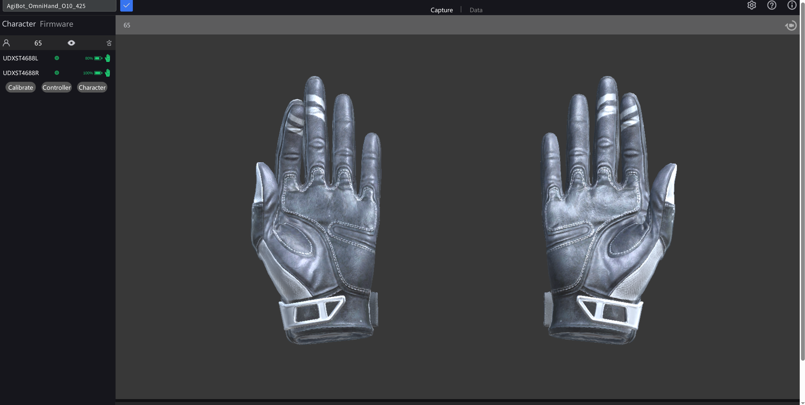
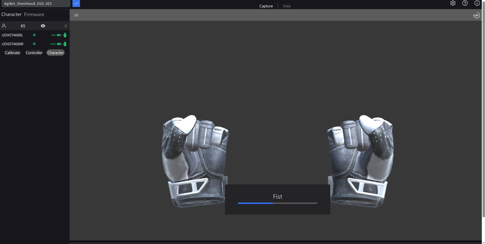
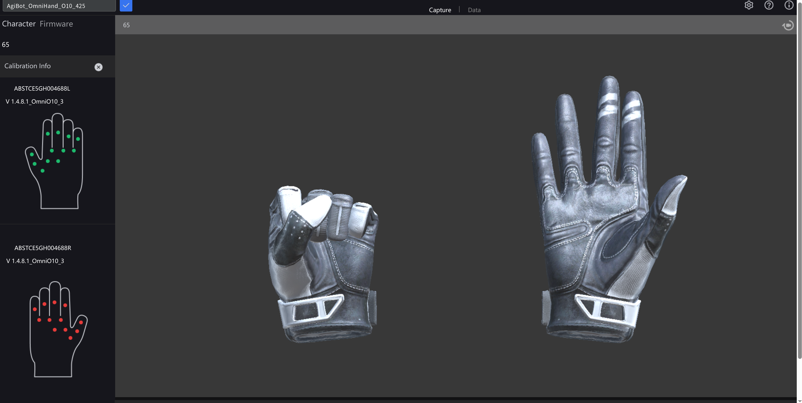

# Udexreal Glove to Agibot O10 Hand Control Guide

This guide is for running the Udexreal glove service and using the glove to control one or two Agibot O10 hands without moving the robot arms.

## Environment

Use the `arm-hand-teleop` conda environment:

```bash
cd ~/workspace/arm-hand-teleop
conda activate arm-hand-teleop
```

The shell scripts also auto-detect this environment, but activating it explicitly makes manual test commands easier to run and debug.

## Start the Glove Service

Start HDService first. It forwards glove data to local UDP port `5555`, which is what the O10 glove-control script reads.

```bash
./scripts/services/start_hdservice.sh
```

For background mode:

```bash
./scripts/services/start_hdservice.sh --background
tail -f logs/hdservice.log
```

Start the HDWeb dashboard in another terminal:

```bash
cd ~/workspace/arm-hand-teleop
conda activate arm-hand-teleop
./scripts/services/start_hdweb.sh
```

Open the printed URL, usually:

```text
http://<robot-pc-ip>:8088/
```

In HDWeb, confirm the glove pair is online before running the control script.

The main HDWeb page should look like this. Both gloves should show green online indicators and reasonable battery levels:

**Figure 1: HDWeb Main Page - Gloves Online**



## Calibrate the Gloves in HDWeb

After the gloves are online, use the HDWeb calibration tools before running O10 hand control.

1. Select the glove character/device in the top-left dropdown.
2. Confirm both left and right gloves are listed in the left panel.
3. Click `Calibrate`.
4. Follow the on-screen calibration pose prompts, such as `Fist`.
5. Keep the hand pose stable until the progress bar completes.

The calibration screen looks like this:

**Figure 2: HDWeb Calibration Page - Follow the Pose Prompt**



## Check Calibration Quality

After calibration, open the calibration information view and inspect the point colors.

- Green points indicate good calibration/tracking.
- Red points indicate poor calibration or a tracking problem.
- If many points are red, recalibrate that glove before controlling the O10 hand.

The check screen looks like this. In this example, the left glove calibration is good, while the right glove needs recalibration:

**Figure 3: Calibration Quality Check - Green Is Good, Red Needs Recalibration**



## Control One O10 Hand

Right hand:

```bash
cd ~/workspace/arm-hand-teleop
conda activate arm-hand-teleop
python tests/test_ude_glove_hand_control.py --mode single --hand right
```

Left hand:

```bash
python tests/test_ude_glove_hand_control.py --mode single --hand left
```

If you need to override the O10 CAN channel:

```bash
python tests/test_ude_glove_hand_control.py --mode single --hand left --channel-id 0
python tests/test_ude_glove_hand_control.py --mode single --hand right --channel-id 1
```

## Control Both O10 Hands

Default dual-hand channels are `left=0` and `right=1`:

```bash
python tests/test_ude_glove_hand_control.py --mode dual
```

Override channels if needed:

```bash
python tests/test_ude_glove_hand_control.py --mode dual --left-channel-id 0 --right-channel-id 1
```

## Dry Run Without Writing Hardware

Use `--no-hw` to verify glove data and the 10D mapping without connecting or writing to O10 hands:

```bash
python tests/test_ude_glove_hand_control.py --mode single --hand right --no-hw
python tests/test_ude_glove_hand_control.py --mode dual --no-hw
```

The terminal prints status lines like:

```text
left:fresh:no-hw:writes=42 deg=[ ... ] | right:fresh:no-hw:writes=42 deg=[ ... ]
```

`fresh` means recent glove data is available. `stale` means no recent glove frame was received, so the script pauses hardware writes for that hand.

## Stop Services

Stop the control script with `Ctrl+C`.

Stop HDService:

```bash
./scripts/services/stop_hdservice.sh
```

Stop HDWeb:

```bash
./scripts/services/stop_hdweb.sh
```

Restart HDService:

```bash
./scripts/services/restart_hdservice.sh
```

## Troubleshooting

- If the script says the glove is not connected, confirm HDService is running and HDWeb shows the glove pair online.
- If status stays `stale`, check that HDService is forwarding to `127.0.0.1:5555`. The repository wrapper script sets `HD_UDP_TARGET=127.0.0.1:5555` automatically.
- If the wrong O10 hand moves, verify `--hand`, `--channel-id`, `--left-channel-id`, and `--right-channel-id`.
- If O10 hand connection fails, check hand power, CANFD adapter selection, `device_id`, and `canfd_id`.
- If using dual-hand mode, keep one HDService instance running. The script uses one shared glove receiver and separates left/right glove data internally.
