# DexHand Motion Control Program (DHMC)

## Download DexHand Motion Control Program (DHMC)

After obtaining the license to use the DHMC from UDEXREAL sales, please provide your GitHub account, and we will invite you to join the DHMC repository.
</br>

## Overview

1. **Data Transmission:** HandDriver sends hand motion data based on the UDP protocol.
2. **Receive and Parse Data:** Receive and parse glove data in the DHMC.
3. **Data Processing:** In the DHMC, select the required data according to each joint of the dexterous hand, and perform processing such as radian mapping on the data according to the format of the dexterous hand.
4. **DexHand Control:** In the DHMC, the processed joint angle data is sent to the dexterous hand (calling the dexterous hand SDK) for motion control.
   </br>

## Receive and Parse Data

1. It's based on the UDP protocol, please ensure that the target IP and port in HandDriver are consistent with those of the receiving end.
2. Distinguish data sources by the character names set in HandDriver and obtain the angle data of the glove from them.
3. Pay attention to distinguishing the left hand, right hand or both hands.
   </br>

## Data Processing

In the DHMC, select the required data according to each joint of the dexterous hand, and process the data, such as performing radian mapping according to the format of the dexterous hand.
</br>

## Robot hand joint mapping reference(Alphabet order)

* AGIBOT OmniHand - [OmniHand 2025](#O10) /  [OmniHand Pro 2025](#O12)
* BrainCo - [Revo1](#Revo1) / [Revo2](#Revo2)
* CHOHO - [CHOHO Hand](#CHOHO)
* DexRobot [DexHand021 Mass Production](#DexHand)
* INSPIRE-ROBOTS [RH56DFX](#Inspire_RH56DFX) / [RH56F1E4](#Inspire_RH56F1E4)
* Leadshine [DH116](#Leadshine)
* LINKERBOT LinkerHand - [O6](#O6) / [O7](#O7) / [L10](#L10) / [L20](#L20)
* OYMotion [ROH-A001 & ROH-AP001](#oyhand)
* PaXini [DexH13 GEN2](#Paxini)
* ROBOTERA [XHAND1](#XHand)
* RUIYAN [RY-H2](#RYHand_H2) / [RY-H15](#RYHand_H15)
* TetherIA [AeroHandOpen](#AeroHandOpen)

Please note: The dexterous hand normalized range in the mapping table does not represent the actual operational angle; it solely indicates the parameter range accepted by the corresponding SDK control-end methods.

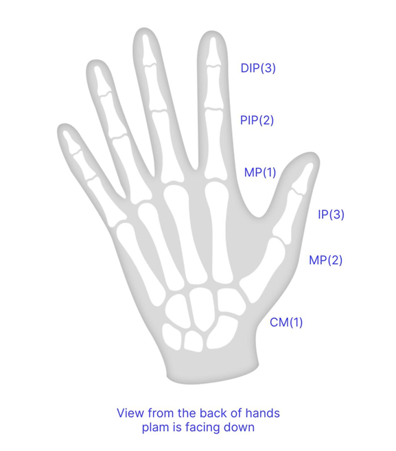
</br>

## AGIBOT

<a id="O10"></a>

### OmniHand 2025（OmniHand_O10）

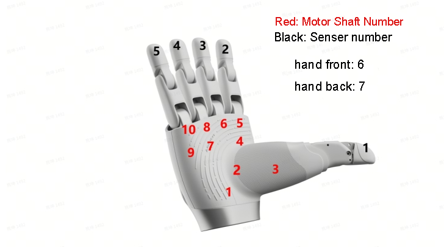


| **O10** | **O10 normalized range(left/right)** | **Udexreal Glove data** | **Glove data range(abs value)** | **Corresponding joint** |
| :-----: | :----------------------------------: | :---------------------: | :-----------------------------: | :---------------------: |
| Joint0  |          [-50,10]/[-10,50]           |         l20/r20         |             [0,37]              |      Thumb CM roll      |
| Joint1  |           [0,100]/[-100,0]           |          l3/r3          |             [0,30]              |      Thumb CM yaw       |
| Joint2  |            [-49,0]/[0,49]            |          l2/r2          |             [0,60]              |     Thumb CM pitch      |
| Joint3  |            [0,12]/[-12,0]            |          l7/r7          |             [0,30]              |      Index MP yaw       |
| Joint4  |            [0,90]/[0,90]             |          l6/r6          |             [0,81]              |     Index MP pitch      |
| Joint5  |            [0,90]/[0,90]             |         l10/r10         |             [0,81]              |     Middle MP pitch     |
| Joint6  |            [-10,0]/[0,10]            |         l15/r15         |             [0,20]              |       Ring MP yaw       |
| Joint7  |            [0,90]/[0,90]             |         l14/r14         |             [0,81]              |      Ring MP pitch      |
| Joint8  |            [-10,0]/[0,10]            |         l19/r19         |             [0,30]              |      Pinky MP yaw       |
| Joint9  |            [0,90]/[0,90]             |         l18/r18         |             [0,100]             |     Pinky MP pitch      |

OmniHand 2025 joint control requires converting degrees to radians using the formula: `angle value * math.pi / 180`
</br>

<a id="O12"></a>

### OmniHand Pro 2025（OmniHand_O12）

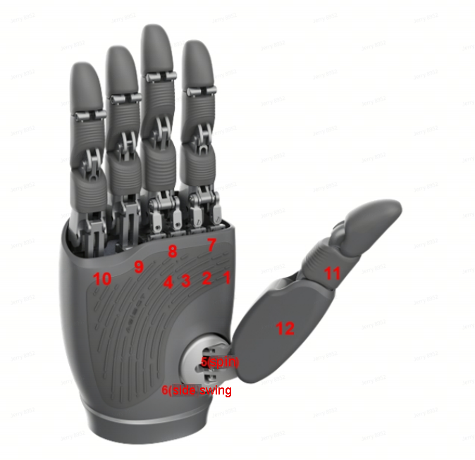


| **O12** | **O12 normalized range(left/right)** | **Udexreal Glove data** | **Glove data range(abs value)** | **Corresponding joint** |
| :-----: | :----------------------------------: | :---------------------: | :-----------------------------: | :---------------------: |
| Joint0  |            [-54,0]/[0,54]            |         l20/r20         |             [0,45]              |      Thumb CM roll      |
| Joint1  |          [0,79.5]/[-79.5,0]          |          l3/r3          |             [5,30]              |      Thumb CM yaw       |
| Joint2  |         [-47.4,0]/[-47.4,0]          |          l2/r2          |             [0,72]              |     Thumb CM pitch      |
| Joint3  |           [-74,0]/[-74,0]            |          l1/r1          |             [0,60]              |     Thumb MP pitch      |
| Joint4  |          [-15,15]/[-15,15]           |          l7/r7          |             [0,25]              |      Index MP yaw       |
| Joint5  |          [0,77.5]/[0,77.5]           |          l6/r6          |             [0,88]              |     Index MP pitch      |
| Joint6  |          [0,88.7]/[0,88.7]           |          l5/r5          |             [0,88]              |     Index PIP pitch     |
| Joint7  |          [-15,15]/[-15,15]           |         l11/r11         |             [0,25]              |      Middle MP yaw      |
| Joint8  |          [0,77.8]/[0,77.8]           |         l10/r10         |             [0,80]              |     Middle MP pitch     |
| Joint9  |           [0,104]/[0,104]            |          l9/r9          |             [0,88]              |    Middle PIP pitch     |
| Joint10 |            [0,88]/[0,88]             |         l14/r14         |             [0,80]              |      Ring MP pitch      |
| Joint11 |            [0,88]/[0,88]             |         l18/r18         |             [0,75]              |     Pinky MP pitch      |

OmniHand pro 2025 joint control requires converting degrees to radians using the formula: `angle value * math.pi / 180`
</br></br>

## BrainCo

<a id="Revo1"></a>

### Revo1

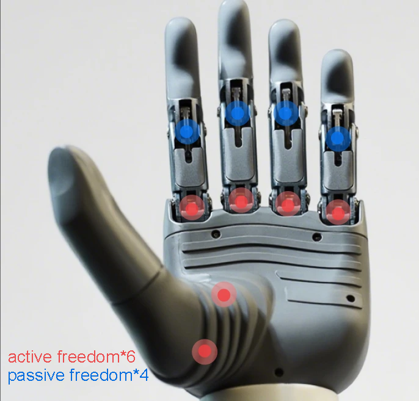

The Revo 1 dexterous hand features 6 active joints, providing a total of 10 degrees of freedom. The thumb possesses two active degrees of freedom: adduction/abduction and flexion/extension. Each of the remaining four fingers has one active degree of freedom for flexion/extension and one passive degree of freedom for flexion/extension.

</br>


| **Revo1**  | **Revo1 normalized range** | **Udexreal Glove data** | **Glove data range(abs value)** | **Corresponding joint** |
| :--------: | :------------------------: | :---------------------: | :-----------------------------: | :---------------------: |
| Thumb Flex |          [0,100]           |          l0/r0          |             [0,55]              |     Thumb IP pitch      |
| Thumb Aux  |          [0,100]           |          l2/r2          |             [0,90]              |     Thumb CM pitch      |
|   Index    |          [0,100]           |          l6/r6          |             [0,70]              |     Index MP pitch      |
|   Middle   |          [0,100]           |         l10/r10         |             [0,70]              |     Middle MP pitch     |
|    Ring    |          [0,100]           |         l14/r14         |             [0,70]              |      Ring MP pitch      |
|   Pinky    |          [0,100]           |         l18/r18         |             [0,70]              |     Pinky MP pitch      |

</br>

<a id="Revo2"></a>

### Revo2

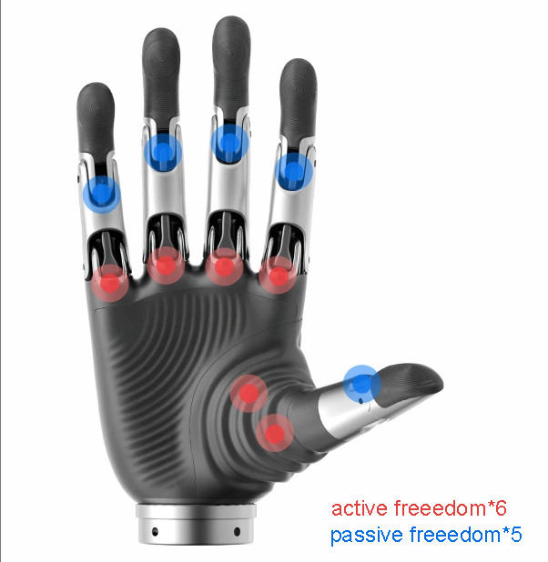

The Revo 2 dexterous hand features 6 active joints, providing a total of 11 degrees of freedom. The thumb possesses two active degrees of freedom—adduction/abduction and flexion/extension—along with one passive degree of freedom for flexion/extension. The remaining four fingers each have one active degree of freedom for flexion/extension and one passive degree of freedom for flexion/extension.
</br>


| **Revo2**  | **Revo2 normalized range** | **Udexreal Glove data** | **Glove data range(abs value)** | **Corresponding joint** |
| :--------: | :------------------------: | :---------------------: | :-----------------------------: | :---------------------: |
| Thumb Flex |          [0,1000]          |          l2/r2          |             [0,60]              |     Thumb IP pitch      |
| Thumb Aux  |          [0,1000]          |          l3/r3          |             [0,30]              |     Thumb CM pitch      |
|   Index    |          [0,1000]          |          l6/r6          |             [0,81]              |     Index MP pitch      |
|   Middle   |          [0,1000]          |         l10/r10         |             [0,81]              |     Middle MP pitch     |
|    Ring    |          [0,1000]          |         l14/r14         |             [0,81]              |      Ring MP pitch      |
|   Pinky    |          [0,1000]          |         l18/r18         |             [0,100]             |     Pinky MP pitch      |

</br></br>

## CHOHO Hand

<a id="CHOHO"></a>

### CHOHO_Hand

| **CHOHO_Hand** | **CHOHO_Hand normalized range** | **Udexreal Glove data** | **Glove data range(abs value)** | **Corresponding joint** |
| :------------: | :-----------------------------: | :---------------------: | :-----------------------------: | :---------------------: |
|     Joint0     |            [0,2500]             |         l18/r18         |             [0,100]             |     Pinky MP pitch      |
|     Joint1     |            [0,2500]             |         l14/r14         |             [0,81]              |      Ring MP pitch      |
|     Joint2     |            [0,2500]             |         l10/r10         |             [0,81]              |     Middle MP pitch     |
|     Joint3     |            [0,2500]             |          l6/r6          |             [0,81]              |     Index MP pitch      |
|     Joint4     |            [0,2500]             |          l2/r2          |             [0,75]              |     Thumb CM pitch      |
|     Joint5     |            [0,2500]             |          l3/r3          |             [0,30]              |      Thumb CM yaw       |
|     Joint6     |            [0,2500]             |         l20/r20         |             [0,31]              |      Thumb CM roll      |

## DexRobot

<a id="DexHand"></a>

### DexHand021 Mass Production

</br>

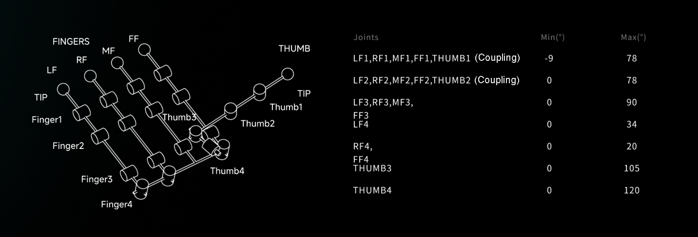

*DexHand021 has no Python SDK support now.


| **DexHand021** | **DexHand021 normalized range** | **Udexreal Glove data** | **Glove data range(part abs value)** | **Corresponding joint** |
| :------------: | :-----------------------------: | :---------------------: | :----------------------------------: | :---------------------: |
|     Joint0     |            [0,10500]            |          l2/r2          |                [0,90]                |     Thumb CM pitch      |
|     Joint1     |            [0,7800]             |          l1/r1          |               [0,125]                |     Thumb MP pitch      |
|     Joint2     |            [0,9000]             |          l6/r6          |               [0,100]                |     Index MP pitch      |
|     Joint3     |            [0,7800]             |          l5/r5          |               [0,100]                |     Index PIP pitch     |
|     Joint4     |            [0,9000]             |         l10/r10         |               [0,100]                |     Middle MP pitch     |
|     Joint5     |            [0,7800]             |          l9/r9          |               [0,100]                |    Middle PIP pitch     |
|     Joint6     |            [0,9000]             |         l14/r14         |               [0,100]                |      Ring MP pitch      |
|     Joint7     |            [0,7800]             |         l13/r13         |               [0,100]                |     Ring PIP pitch      |
|     Joint8     |            [0,9000]             |         l18/r18         |               [0,100]                |     Pinky MP pitch      |
|     Joint9     |            [0,7800]             |         l17/r17         |               [0,100]                |     Pinky PIP pitch     |
|    Joint10     |            [0,12000]            |          l7/r7          |                [0,25]                |      Index MP yaw       |
|    Joint11     |            [0,3400]             |         l20/r20         |               [0,120]                |      Thumb CM roll      |

</br></br>

## INSPIRE-ROBOTS

<a id="Inspire_RH56DFX"></a>

### RH56DFX

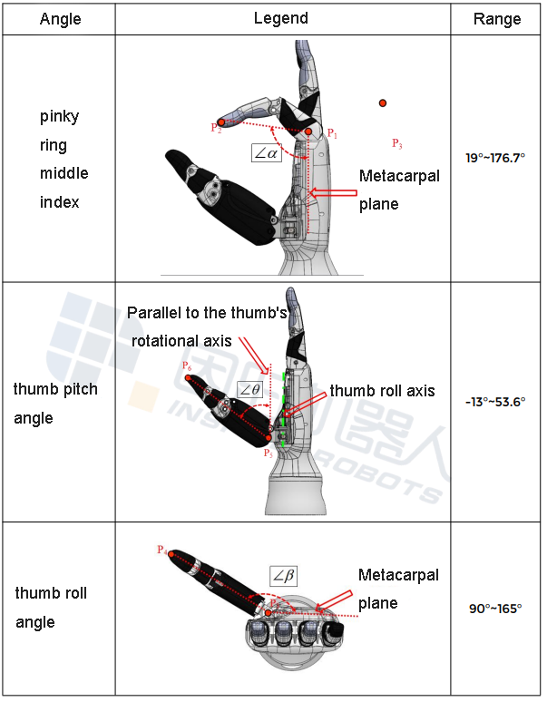


| **RH56DFX** | **RH56DFX normalized range** | **Udexreal Glove data** | **Glove data range(abs value)** | **Corresponding joint** |
| :---------: | :--------------------------: | :---------------------: | :-----------------------------: | :---------------------: |
|   Joint0    |           [0,1000]           |         l18/r18         |             [0,176]             |     Pinky MP pitch      |
|   Joint1    |           [0,1000]           |         l14/r14         |             [0,176]             |      Ring MP pitch      |
|   Joint2    |           [0,1000]           |         l10/r10         |             [0,176]             |     Middle MP pitch     |
|   Joint3    |           [0,1000]           |          l6/r6          |             [0,176]             |     Index MP pitch      |
|   Joint4    |           [0,1000]           |          l0/r0          |             [0,53]              |     Thumb IP pitch      |
|   Joint5    |           [0,1000]           |          l2/r2          |             [0,165]             |     Thumb CM pitch      |

</br></br>

<a id="Inspire_RH56F1E4"></a>

### RH56F1E4

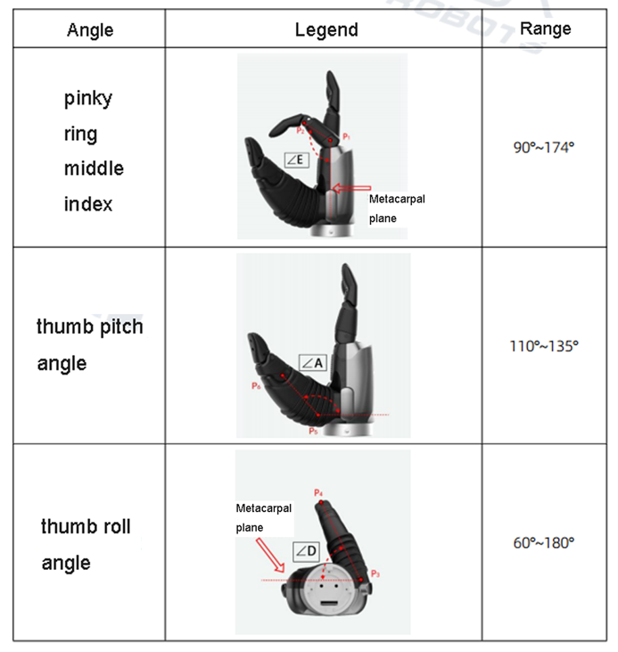


| **RH56F1E4** | **RH56F1E4 normalized range** | **Udexreal Glove data** | **Glove data range(abs value)** | **Corresponding joint** |
| :----------: | :---------------------------: | :---------------------: | :-----------------------------: | :---------------------: |
|    Joint0    |          [900,1740]           |         l18/r18         |             [0,81]              |     Pinky MP pitch      |
|    Joint1    |          [900,1740]           |         l14/r14         |             [0,81]              |      Ring MP pitch      |
|    Joint2    |          [900,1740]           |         l10/r10         |             [0,81]              |     Middle MP pitch     |
|    Joint3    |          [900,1740]           |          l6/r6          |             [0,81]              |     Index MP pitch      |
|    Joint4    |          [1100,1350]          |          l2/r2          |             [0,75]              |     Thumb CM pitch      |
|    Joint5    |          [600,1800]           |          l3/r3          |             [0,30]              |      Thumb CM yaw       |

</br></br>

## Leadshine

<a id="Leadshine"></a>

### DH116

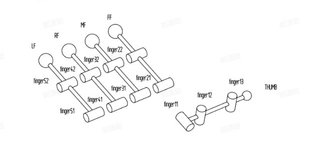


| **DH116** | **DH116 normalized range** | **Udexreal Glove data** | **Glove data range(part abs value left/right)** | **Corresponding joint** |
| :-------: | :------------------------: | :---------------------: | :---------------------------------------------: | :---------------------: |
|  Joint0   |         [0,10000]          |          l3/r3          |                [-30,-5]/[-30,-5]                |      Thumb CM yaw       |
|  Joint1   |         [0,10000]          |          l2/r2          |                  [0,60]/[0,54]                  |     Thumb CM pitch      |
|  Joint2   |         [0,10000]          |          l6/r6          |                 [0,100]/[0,90]                  |     Index MP pitch      |
|  Joint3   |         [0,10000]          |         l10/r10         |                  [0,90]/[0,90]                  |     Middle MP pitch     |
|  Joint4   |         [0,10000]          |         l14/r14         |                  [0,80]/[0,80]                  |      Ring MP pitch      |
|  Joint5   |         [0,10000]          |         l18/r18         |                  [0,75]/[0,75]                  |     Pinky MP pitch      |

</br></br>

## LINKERBOT

</br>
<a id="O6"></a>

### O6


| **O6** | **O6 normalized range** | **Udexreal Glove data** | **Glove data range(abs value)** | **Corresponding joint** |
| :----: | :---------------------: | :---------------------: | :-----------------------------: | :---------------------: |
| Joint0 |         [0,255]         |          l2/r2          |             [0,54]              |     Thumb CM pitch      |
| Joint1 |         [0,255]         |          l3/r3          |             [0,20]              |      Thumb CM yaw       |
| Joint2 |         [0,255]         |          l6/r6          |             [0,80]              |     Index MP pitch      |
| Joint3 |         [0,255]         |         l10/r10         |             [0,80]              |     Middle MP pitch     |
| Joint4 |         [0,255]         |         l14/r14         |             [0,80]              |      Ring MP pitch      |
| Joint5 |         [0,255]         |         l18/r18         |             [0,80]              |     Pinky MP pitch      |

</br>
<a id="O7"></a>

### O7


| **O7** | **O7 normalized range** | **Udexreal Glove data** | **Glove data range(abs value)** | **Corresponding joint** |
| :----: | :---------------------: | :---------------------: | :-----------------------------: | :---------------------: |
| Joint0 |         [0,255]         |          l2/r2          |             [0,72]              |     Thumb CM pitch      |
| Joint1 |         [0,255]         |          l3/r3          |             [0,30]              |      Thumb CM yaw       |
| Joint2 |         [0,255]         |          l6/r6          |             [0,81]              |     Index MP pitch      |
| Joint3 |         [0,255]         |         l10/r10         |             [0,81]              |     Middle MP pitch     |
| Joint4 |         [0,255]         |         l14/r14         |             [0,81]              |      Ring MP pitch      |
| Joint5 |         [0,255]         |         l18/r18         |             [0,100]             |     Pinky MP pitch      |
| Joint6 |         [0,255]         |         l20/r20         |             [0,43]              |      Thumb CM roll      |

</br>
<a id="L10"></a>

### L10


| **L10** | **L10 normalized range** | **Udexreal Glove data** | **Glove data range(abs value)** | **Corresponding joint** |
| :-----: | :----------------------: | :---------------------: | :-----------------------------: | :---------------------: |
| Joint0  |         [0,255]          |          l2/r2          |             [0,75]              |     Thumb CM pitch      |
| Joint1  |         [0,255]          |          l3/r3          |             [0,30]              |      Thumb CM yaw       |
| Joint2  |         [0,255]          |          l6/r6          |             [0,81]              |     Index MP pitch      |
| Joint3  |         [0,255]          |         l10/r10         |             [0,81]              |     Middle MP pitch     |
| Joint4  |         [0,255]          |         l14/r14         |             [0,81]              |      Ring MP pitch      |
| Joint5  |         [0,255]          |         l18/r18         |             [0,100]             |     Pinky MP pitch      |
| Joint6  |         [0,255]          |          l7/r7          |             [0,30]              |      Index MP yaw       |
| Joint7  |         [0,255]          |         l15/r15         |             [0,19]              |       Ring MP yaw       |
| Joint8  |         [0,255]          |         l19/r19         |             [0,25]              |      Pinky MP yaw       |
| Joint9  |         [0,255]          |         l20/r20         |             [0,43]              |      Thumb CM roll      |

</br>
<a id="L20"></a>

### L20


| **L20** | **L20 normalized range** | **Udexreal Glove data** | **Glove data range(part abs value)** | **Corresponding joint** |
| :-----: | :----------------------: | :---------------------: | :----------------------------------: | :---------------------: |
| Joint0  |         [0,255]          |          l1/r1          |               [0,100]                |     Thumb MP pitch      |
| Joint1  |         [0,255]          |          l6/r6          |                [0,80]                |     Index MP pitch      |
| Joint2  |         [0,255]          |         l10/r10         |                [0,80]                |     Middle MP pitch     |
| Joint3  |         [0,255]          |         l14/r14         |                [0,80]                |      Ring MP pitch      |
| Joint4  |         [0,255]          |         l18/r18         |                [0,80]                |     Pinky MP pitch      |
| Joint5  |         [0,255]          |          l2/r2          |                [0,80]                |     Thumb CM pitch      |
| Joint6  |         [0,255]          |          l7/r7          |              [-30，30]               |      Index MP yaw       |
| Joint7  |         [0,255]          |         l11/r11         |              [-30，30]               |      Middle MP yaw      |
| Joint8  |         [0,255]          |         l15/r15         |              [-30，30]               |       Ring MP yaw       |
| Joint9  |         [0,255]          |         l19/r19         |              [-30，30]               |      Pinky MP yaw       |
| Joint10 |         [0,255]          |         l20/r20         |                [0,88]                |      Thumb CM roll      |
| Joint11 |         [0,255]          |            /            |                  0                   |            /            |
| Joint12 |         [0,255]          |            /            |                  0                   |            /            |
| Joint13 |         [0,255]          |            /            |                  0                   |            /            |
| Joint14 |         [0,255]          |            /            |                  0                   |            /            |
| Joint15 |         [0,255]          |          l0/r0          |                [0,88]                |     Thumb IP pitch      |
| Joint16 |         [0,255]          |          l5/r5          |                [0,88]                |     Index PIP pitch     |
| Joint17 |         [0,255]          |          l9/r9          |                [0,88]                |    Middle PIP pitch     |
| Joint18 |         [0,255]          |         l13/r13         |                [0,88]                |     Ring PIP pitch      |
| Joint19 |         [0,255]          |         l17/r17         |                [0,88]                |     Pinky PIP pitch     |

</br></br>

## OYMotion

<a id="oyhand"></a>

### ROH-A001 & ROH-AP001


| **ROH-A001 & ROH-AP001** | **ROH-A001 & ROH-AP001 normalized range** | **Udexreal Glove data** | **Glove data range(abs value)** | **Corresponding joint** |
| :----------------------: | :---------------------------------------: | :---------------------: | :-----------------------------: | :---------------------: |
|          Joint0          |                 [0,65535]                 |          l1/r1          |             [0,40]              |     Thumb MP pitch      |
|          Joint1          |                 [0,65535]                 |          l5/r5          |             [0,80]              |     Index PIP pitch     |
|          Joint2          |                 [0,65535]                 |          l9/r9          |             [0,80]              |    Middle PIP pitch     |
|          Joint3          |                 [0,65535]                 |         l13/r13         |             [0,80]              |     Ring PIP pitch      |
|          Joint4          |                 [0,65535]                 |         l17/r17         |             [0,80]              |     Pinky PIP pitch     |
|          Joint5          |                 [0,65535]                 |         l20/r20         |             [0,40]              |      Thumb CM roll      |

</br></br>

## PaXini

<a id="Paxini"></a>

### DexH13 GEN2

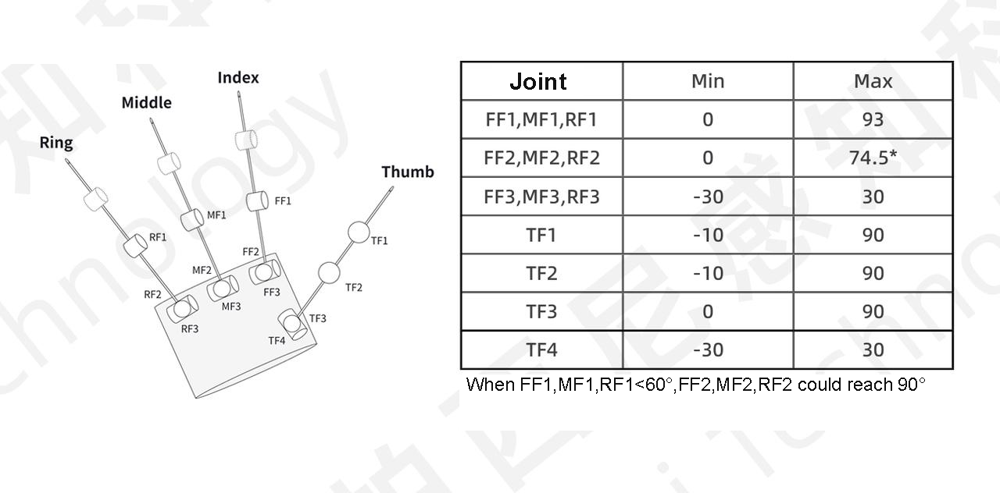


| **DexH13 GEN2** | **DexH13 GEN2 normalized range** | **Udexreal Glove data** | **Corresponding joint** |
| :-------------: | :------------------------------: | :---------------------: | :---------------------: |
|     Joint0      |             [-20,20]             |          l7/r7          |      Index MP yaw       |
|     Joint1      |              [0,90]              |          l6/r6          |     Index MP pitch      |
|     Joint2      |              [0,90]              |          l5/r5          |     Index PIP pitch     |
|     Joint3      |              [0,90]              |          l4/r4          |     Index DIP pitch     |
|     Joint4      |             [-20,20]             |         l11/r11         |      Middle MP yaw      |
|     Joint5      |              [0,90]              |         l10/r10         |     Middle MP pitch     |
|     Joint6      |              [0,90]              |          l9/r9          |    Middle PIP pitch     |
|     Joint7      |              [0,90]              |          l8/r8          |    Middle DIP pitch     |
|     Joint8      |             [-20,20]             |         l15/r15         |       Ring MP yaw       |
|     Joint9      |              [0,90]              |         l14/r14         |      Ring MP pitch      |
|     Joint10     |              [0,90]              |         l13/r13         |     Ring PIP pitch      |
|     Joint11     |              [0,90]              |         l12/r12         |     Ring DIP pitch      |
|     Joint12     |             [-20,20]             |          l3/r3          |      Thumb CM yaw       |
|     Joint13     |              [0,90]              |          l2/r2          |     Thumb CM pitch      |
|     Joint14     |              [0,90]              |          l1/r1          |     Thumb MP pitch      |
|     Joint15     |              [0,90]              |          l0/r0          |     Thumb IP pitch      |

PaXini joint control requires converting degrees to radians using the formula: `angle value * math.pi / 180`

</br></br>

## ROBOTERA

<a id="XHand"></a>

### XHAND1

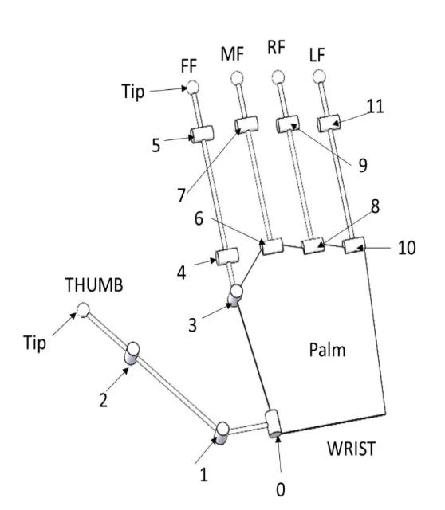


| **XHAND1** | **XHAND1 normalized range** | **Udexreal Glove data** | **Glove data range(part abs value)** | **Corresponding joint** |
| :--------: | :-------------------------: | :---------------------: | :----------------------------------: | :---------------------: |
|   Joint0   |           [0,105]           |          l2/r2          |               [0,110]                |     Thumb CM pitch      |
|   Joint1   |          [-40,100]          |          l1/r1          |                [0,60]                |     Thumb MP pitch      |
|   Joint2   |           [0,100]           |          l0/r0          |                [0,60]                |     Thumb IP pitch      |
|   Joint3   |          [-10,10]           |          l7/r7          |                [0,24]                |      Index MP yaw       |
|   Joint4   |           [0,110]           |          l6/r6          |               [0,100]                |     Index MP pitch      |
|   Joint5   |           [0,110]           |          l5/r5          |               [0,100]                |     Index PIP pitch     |
|   Joint6   |           [0,110]           |         l10/r10         |               [0,100]                |     Middle MP pitch     |
|   Joint7   |           [0,110]           |          l9/r9          |               [0,100]                |    Middle PIP pitch     |
|   Joint8   |           [0,110]           |         l14/r14         |               [0,100]                |      Ring MP pitch      |
|   Joint9   |           [0,110]           |         l13/r13         |               [0,100]                |     Ring PIP pitch      |
|  Joint10   |           [0,110]           |         l18/r18         |               [0,100]                |     Pinky MP pitch      |
|  Joint11   |           [0,110]           |         l17/r17         |               [0,100]                |     Pinky PIP pitch     |

ROBOTERA joint control uses radians. Refer to the `XHandControlExample.run_yudie()` method in the main example. You need to multiply the angle by `math.pi / 180` before assigning it to the joint position.

</br></br>

## RUIYAN

<a id="RYHand_H2"></a>

### RY-H2

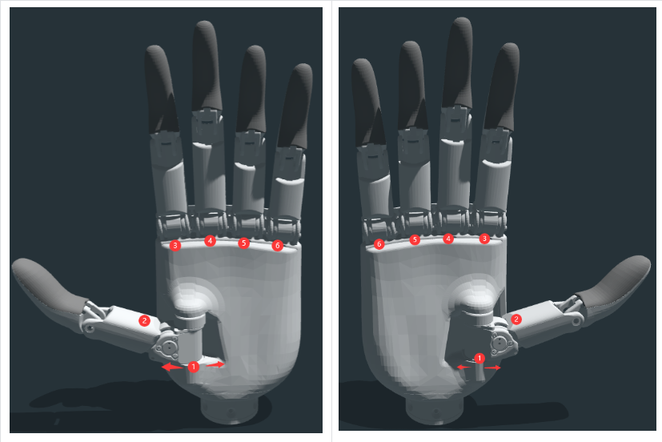


| **RY-H2** | **RY-H2 normalized range** | **Udexreal Glove data** | **Glove data range(part abs value)** | **Corresponding joint** |
| :-------: | :------------------------: | :---------------------: | :----------------------------------: | :---------------------: |
|  Joint0   |          [0,135]           |          l3/r3          |               [-30,-5]               |      Thumb CM yaw       |
|  Joint1   |           [0,40]           |          l2/r2          |                [0,60]                |     Thumb CM pitch      |
|  Joint2   |           [0,87]           |          l6/r6          |                [0,81]                |     Index MP pitch      |
|  Joint3   |           [0,90]           |         l10/r10         |                [0,81]                |     Middle MP pitch     |
|  Joint4   |           [0,90]           |         l14/r14         |                [0,81]                |      Ring MP pitch      |
|  Joint5   |           [0,88]           |         l18/r18         |               [0,100]                |     Pinky MP pitch      |

<a id="RYHand_H15"></a>

### RY-H15

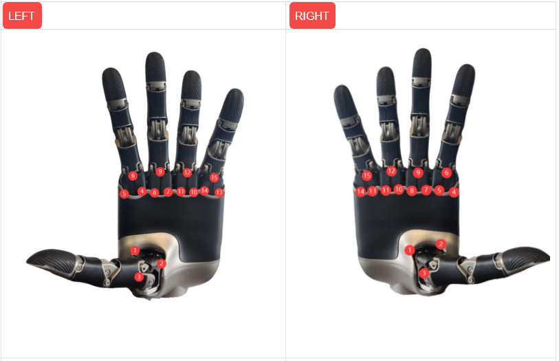

| **RY-H15** | **RY-H15 normalized range** | **Udexreal Glove data** | **Glove data range(part abs value)** | **Corresponding joint** |
| :--------: | :-------------------------: | :---------------------: | :----------------------------------: | :---------------------: |
|   Joint0   |          [-30,30]           |          l3/r3          |                [0,30]                |      Thumb CM yaw       |
|   Joint1   |           [0,90]            |          l2/r2          |                [0,75]                |     Thumb CM pitch      |
|   Joint2   |           [0,75]            |          l1/r1          |                [0,90]                |     Thumb MP pitch      |
|   Joint3   |          [-30,30]           |          l7/r7          |                [0,30]                |      Index MP yaw       |
|   Joint4   |           [0,90]            |          l6/r6          |                [0,81]                |     Index MP pitch      |
|   Joint5   |           [0,75]            |          l5/r5          |               [0,100]                |     Index PIP pitch     |
|   Joint6   |          [-30,30]           |            /            |                  /                   |      Middle MP yaw      |
|   Joint7   |           [0,90]            |         l10/r10         |                [0,81]                |     Middle MP pitch     |
|   Joint8   |           [0,75]            |          l9/r9          |                [0,81]                |    Middle PIP pitch     |
|   Joint9   |          [-30,30]           |         l15/r15         |                [0,20]                |       Ring MP yaw       |
|  Joint10   |           [0,90]            |         l14/r14         |                [0,81]                |      Ring MP pitch      |
|  Joint11   |           [0,75]            |         l13/r13         |               [0,100]                |     Ring PIP pitch      |
|  Joint12   |          [-30,30]           |         l19/r19         |                [0,30]                |      Pinky MP yaw       |
|  Joint13   |           [0,90]            |         l18/r18         |               [0,100]                |     Pinky MP pitch      |
|  Joint14   |           [0,75]            |         l17/r17         |               [0,100]                |     Pinky PIP pitch     |

</br></br>

## TetherIA

<a id="AeroHandOpen"></a>

### Aero Hand Open

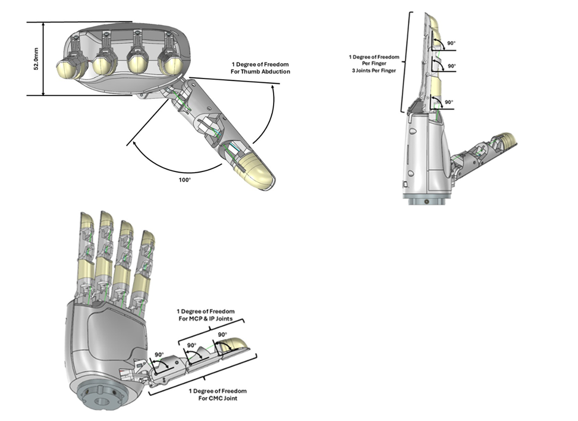

| **Aero Hand Open** | **Aero Hand Open range** | **Udexreal Glove data** | **Glove data range(part abs value)** | **Corresponding joint** |
| :----------------: | :----------------------: | :---------------------: | :----------------------------------: | :---------------------: |
|       Joint0       |         [0,100]          |          l3/r3          |                [0,30]                |      Thumb CM yaw       |
|       Joint1       |          [0,55]          |          l2/r2          |                [0,75]                |     Thumb CM pitch      |
|       Joint2       |          [0,90]          |          l1/r1          |                [0,90]                |     Thumb MP pitch      |
|       Joint3       |          [0,90]          |          l0/r0          |                [0,90]                |     Thumb IP pitch      |
|       Joint4       |          [0,90]          |          l6/r6          |                [0,81]                |     Index MP pitch      |
|       Joint5       |          [0,90]          |          l5/r5          |               [0,100]                |     Index PIP pitch     |
|       Joint6       |          [0,90]          |          l4/r4          |                [0,80]                |     Index DIP pitch     |
|       Joint7       |          [0,90]          |         l10/r10         |                [0,81]                |     Middle MP pitch     |
|       Joint8       |          [0,90]          |          l9/r9          |                [0,81]                |    Middle PIP pitch     |
|       Joint9       |          [0,90]          |          l8/r8          |                [0,80]                |    Middle DIP pitch     |
|      Joint10       |          [0,90]          |         l14/r14         |                [0,81]                |      Ring MP pitch      |
|      Joint11       |          [0,90]          |         l13/r13         |               [0,100]                |     Ring PIP pitch      |
|      Joint12       |          [0,90]          |         l12/r12         |                [0,80]                |     Ring DIP pitch      |
|      Joint13       |          [0,90]          |         l18/r18         |               [0,100]                |     Pinky MP pitch      |
|      Joint14       |          [0,90]          |         l17/r17         |               [0,100]                |     Pinky PIP pitch     |
|      Joint15       |          [0,90]          |         l16/r16         |                [0,80]                |     Pinky DIP pitch     |


</br></br>

## DexHand Control

1. Configure the environment and test whether the official example can run successfully according to the official example documentation.
2. After running through the official example, send the processed joint angle data to the dexterous hand SDK for dexterous hand motion control.
   </br>

### Usage Guide

In `DexHand_Motion_Control_Program.py`, the initial part of main function is the basic config. When running this script, it will use all the default parameters, make sure to modify it before start.

```
parser = argparse.ArgumentParser(description='DexHand Motion Control Program (DHMC)')
parser.add_argument('--mode', choices=[
                  'agibotHand_O10',
                  'agibotHand_O12',
                  'brainco_revo1', 
                  'brainco_revo2',
                  'CHOHO',
                  'inspire_RH56DFX', 
                  'inspire_RH56F1E4',
                  'DH116',
                  'linkerhand_O6',
                  'linkerhand_O7', 
                  'linkerhand_L10', 
                  'linkerhand_L20', 
                  'oyhand', 
                  'dexh13',
                  'xhand', 
                  'ryHand_H2',
                  'ryHand_H15',
                  "AeroHand"], 
                  help='Choose robot hand type', default='')
parser.add_argument('--dataType', type=str, choices=['Json','Protobuf','TeleopProtobuf'], help='Data receive type, default is Json. TeleopProtobuf is the protobuf from VR application.', default='Json')
parser.add_argument('--ip', help='IP address, default is local IP 127.0.0.0', default='127.0.0.1')
parser.add_argument('--port', type=int, help='Port number, default is 7777', default=7777)
parser.add_argument('--role', type=str, help='Role name, if cannot find, take first one as default under Json data type, Protobuf needs exact correct role name', default="teleop")
parser.add_argument('--usb', type=str, help='The USB port of robot hand, on WIN sys the default is COM1, on LINUX sys is /dev/ttyUSB0, for CAN is PCAN_USBBUS1', default='COM1')
parser.add_argument('--hand', type=str, choices=['left', 'right', 'both'], help='Control left, right or both hand(not all hands provide both sample)', default='left')
parser.add_argument('--canType', choices= ['multiChannel','multiCan'], type=str, help='AGIBOT CAN Control Mode(only work when using agibotHand_O10 or agibotHand_O12)', default='multiCan')
```

`Data_Receiver.py` is UDP data server, it's recommended not modify it in case causing connection error.

`Protobuf` folder contains the proto data rules，you never need to modify it.

If nothing wrong, run the `DexHand_Motion_Control_Program.py`, you will see the terminal window print message like this, then you can switch on the data streaming on HandDriver.

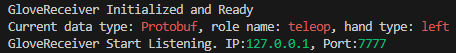

### *To use specific robot hand, please place the corresponding folder **(remove "-main" in folder name)** directly in the project path.*

### Common Error Fixing Steps

* If terminal window stuck and print error message where belongs to robot hand SDK, please contact the robot hand compony for help and get proper SDK.
* If no data is received for a long while, check the setting config in HandDriver first, whether `data type`, `IP`, `port number` and `role` are correct and is the same as those default parameters used. Restart HandDriver and Python application if all the config is correct.
* If data can be received but robot hand has no motion or weired motion, check if **HandDriver motion capture** and **character matching** is well, and the `hand` config is correct. Still cannot solve it, try to control the robot hand on its master computer program or offical SDK program to troubleshoot hardware problems.
* You may contact us for more support.
